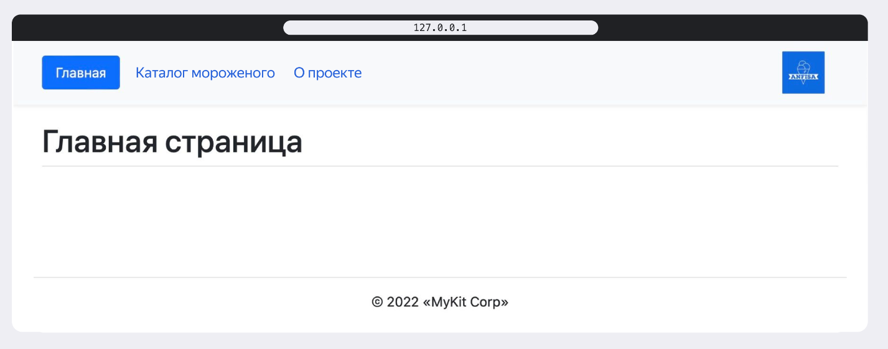

# Анфиса для друзей

## Установка окружения 
### Распакуйте проект «Мороженое» в папку, например *Dev/*.

Должна получиться такая структура:

```
Dev/
 └── ice_cream_2_final/
     ├── anfisa_for_friends/
     ├── html_templates/
     ├── .gitignore
     ├── LICENSE
     ├── requirements.txt
     └── README.md
```


### Убедитесь, что вы используете python 3.9!!!
### Создайте виртуальное окружение

1. Запустите редактор Visual Studio Code и через меню «*Файл» / «Открыть директорию»* откройте папку *Dev/ice_cream_2_final/*. 
2. Запустите терминал в VS Code, удостоверьтесь, что вы работаете из директории *ice_cream_2_final/* (если вы работаете под Windows, убедитесь, что в терминале запущен Git Bash, а не PowerShell или что-нибудь ещё), и выполните команду:
- Linux/macOS
    
    ```bash
    python3 -m venv venv
    ```
    
- Windows
    
    ```python
    python -m venv venv
    ```
   
В директории *ice_cream_2_final/* будет развёрнуто виртуальное окружение и появится папка `venv`, в которой будут храниться все зависимости проекта, а структура файлов станет такой:

```

Dev/
└── ice_cream_2_final/
    ├── anfisa_for_friends/
    ├── html_templates/
    ├── venv/   
    ├── .gitignore
    ├── LICENSE
    ├── requirements.txt
    └── README.md
```

### Активация виртуального окружения
в терминале перейдите в корневую директорию проекта(если ещё не там) *Dev/ice_cream_2_final/* и выполните команду:
- Linux/macOS
    
    ```bash
    source venv/bin/activate
    ```
    
- Windows
    
    ```bash
    source venv/Scripts/activate
    ```
    

Теперь все команды в терминале будут предваряться строкой `(venv)`.

💡 Все дальнейшие команды в терминале надо выполнять с активированным виртуальным окружением.

Обновите pip:

```bash
python -m pip install --upgrade pip
```

### Установка зависимостей из файла *requirements.txt*:
Находясь в папке *Dev/ice_cream_2_final/*, выполните команду:

```bash
pip install -r requirements.txt
```

### Применение миграций

    
В директории с файлом manage.py выполните команду: 

```bash
python manage.py migrate
```

### Запуск проекта в dev-режиме

    
В директории с файлом manage.py выполните команду: 

```bash
python manage.py runserver
```

В ответ Django сообщит, что сервер запущен и проект доступен по адресу [http://127.0.0.1:8000/](http://127.0.0.1:8000/). 


## Задание
Проект «Мороженое», который вы развернули на своём компьютере, содержит несколько страниц. К проекту уже подключены шаблоны, они разбиты на логические блоки; файлы, из которых рендерится шаблон, лежат в каталоге anfisa_for_friends/templates.
```

Dev/
 └── ice_cream_2_final/
     ├── anfisa_for_friends/
           ├── ...
           ├── static_dev/         <--- Тут лежит подключённая статика
           ├── templates/          <--- Тут лежат подключённые шаблоны
           ├── ...
     ├── html_templates/           <--- Тут лежит новая вёрстка и статика
     ├── .gitignore
     ├── LICENSE
     ├── README.md
     └── requirements.txt
```

В директории ice_cream_2_final/html_templates лежат HTML-файлы с новой вёрсткой для страниц проекта, а также необходимая для них статика — файлы картинок, CSS и JS.
Ваша задача — обновить шаблоны проекта, используя новую вёрстку.


### Порядок выполнения задания:
1. В новых HTML-файлах комментариями отмечены границы блоков, по которым нужно разделить код на шаблоны. Перенесите код в соответствующие файлы:
   - в base.html,
   - в файлы header.html и footer.html,
   - в файлы, подключаемые через . Если какой-то фрагмент HTML-кода встречается больше двух раз, выносите этот фрагмент в отдельный файл и включайте его в основной код через .

2. Обновите содержимое шаблонов index.html, description.html, list.html и detail.html:
   - они по-прежнему должны расширять базовый шаблон base.html,
   - в HTML-файлах с новой вёрсткой комментариями отмечены границы блоков title и content; в этих файлах вы найдёте обновлённое содержимое блоков.

3. Обновите содержимое директории static_dev: для работы проекта понадобятся новые картинки и новая статика из каталога html_templates.

4. В файлах base.html и header.html проверьте и, при необходимости, обновите адреса подключения файлов статики, а также ссылки на страницы.

5. Настройте шаблоны так, чтобы ссылка на просматриваемую страницу была всегда «подсвечена» в меню сайта.


Запустите проект и убедитесь, что всё работает. Если задание выполнено правильно, то страницы будут выглядеть так:


### Подсказки
1. Задание довольно большое. Стоит разбить его на подзадачи и «есть слона по частям».

2. Расположение статических файлов указывают через тег .

3. Чтобы указать адреса ссылок через name и namespace — применяйте тег .

4. Чтобы отобразить несколько одинаковых элементов на странице, в шаблоне пройдите циклом  по коллекции, которая хранит эти элементы.

5. При необходимости применяйте тег . В header будет удобно использовать конструкцию  для упрощения работы со ссылками. 

